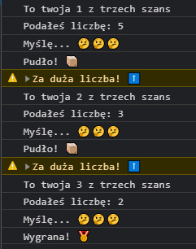
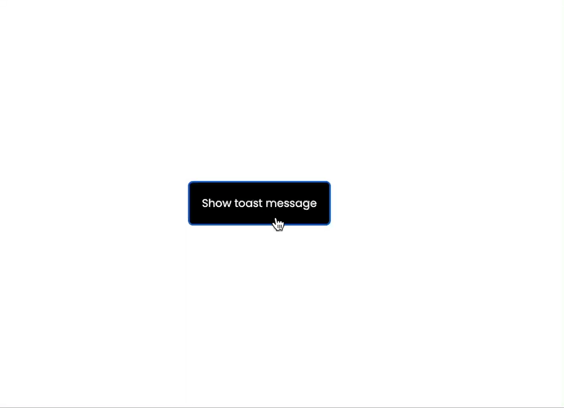
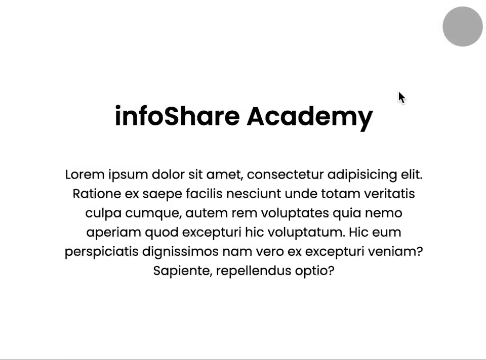
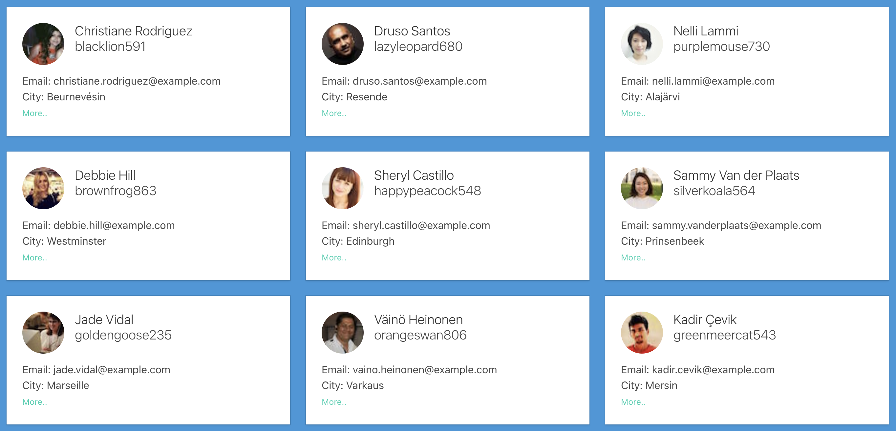

# 📡 Zadania z wykorzystania Web APIs

**💡 UWAGA:** W katalogu z pracą domową utwórz katalog `03-web-apis` w którym umieścisz rozwiązanie do poniższych ćwiczeń. Dla każdego ćwiczenia utwórz osobny plik np. `01-challenge.js`, `02-challenge.js` itd. 
Zadania będą wymagać utworzenia pliku HTML i podłączenia do nich skryptu *JavaScript* - dla każdego zadania utwórz osobny plik HTML. <u>W ramach poniższych ćwiczeń nie wykorzystujemy żadnego frameworka *JavaScript*.</u>

## 🛠 Challenge 1 - Zgaduj zgadula *(do zdobycia: 1 pkt.)*

Napisz grę z wykorzystaniem wiedzy z dzisiejszych zajęć. Celem gry jest wylosowanie tajnej liczby z zakresu od 1 do 10 przez komputer, a następnie pobieranie liczb od użytkownika (za pomocą metody `window.prompt()`) z tego zakresu.

Każdy użytkownik ma trzy szanse i na początku każdej "tury" informujemy użytkownika o ilości szans jaką posiada. Po tym jak użytkownik wprowadzi liczbę imitujemy "myślenie" komputera, które powinno dać wrażenie użytkownikowi "sprawdzania liczby przez komputer" i po około dwóch sekundach powinniśmy użytkownika poinformować czy trafił wylosowaną liczbę. Jeśli tak to kończymy grę wyswietlając komunikat o wygranej, jeżeli użytkownik po trzech próbach nie trafił kończymy grę informując o porażce.

Żeby ułatwić użytkownikowi odgadnięcie liczby wyświetlaj po każdej nieudanej próbie odgadnięcia komunikat, czy liczba którą przekazał jest "za duża" czy "za mała".

Gra może wyglądać w ten sposób:

**Podpowiedź:** Do tego zadania może Ci się przydać [rekurencja](https://pl.wikipedia.org/wiki/Rekurencja).

## 🛠 Challenge 2 - powiadomienie *Toast* *(do zdobycia: 1 pkt.)*

Zaimplementuj funkcjonalnośc tzw. *Toast message*. Po kliknięciu w przycisk na stronie wyświetlaj powiadomienia *Toast*.

Poniżej przykład (po każdym kliknięciu w przycisk przez okres kilku sekund wyświetla się powiadomienie i najnowsze powiadomienia wyświetlają się powyżej powiadomień starszych).

Przykład:

## 🛠 Challenge 3 - Dark mode *(do zdobycia: 1 pkt.)*

Przygotuj przycisk po kliknięciu którego przełączysz tryb kolorystyczny aplikacji - domyślnie będzie to przełączenie z trybu jasnego na tryb ciemny.

Przykład:

## 🛠 Challenge 4 - Karuzela *(do zdobycia: 1 pkt.)*

Zaimplementuj komponent "carousel" w ramach którego po krótkiej chwili będą się pokazywać kolejne grafiki (możesz wybrać dowolne grafiki z serwisu [unsplash](https://unsplash.com/)). Przejścia pomiędzy grafikami powinny być animowane i po pokazaniu wszystkich grafik, efekt karuzeli powinien powracać do pierwszego zdjęcia.

Przykład:

## 🛠 Challenge 5 - Karty użytkowników *(do zdobycia: 1 pkt.)*

Przygotuj listę użytkowników aplikacji - lista powinna być siatką 3x3 na której wyświetli karty poszczególnych użytkowników. Zadanie to wymaga komunikacji z [jsonplaceholder](https://jsonplaceholder.typicode.com), a konkretnie z *endpointu* [/users](https://jsonplaceholder.typicode.com/users).

Każda karta powinna zawierać:

- Imię i nazwisko
- Nazwę użytkownika
- Email
- Miejscowość w której użytkownik mieszka

Przykład:

**Zdjęcia użytkowników możesz wybrać dowolne (np. z **[unsplash](https://unsplash.com/)**), a przycisk "More..." nie musi mieć żadnej funkcjonalności.**