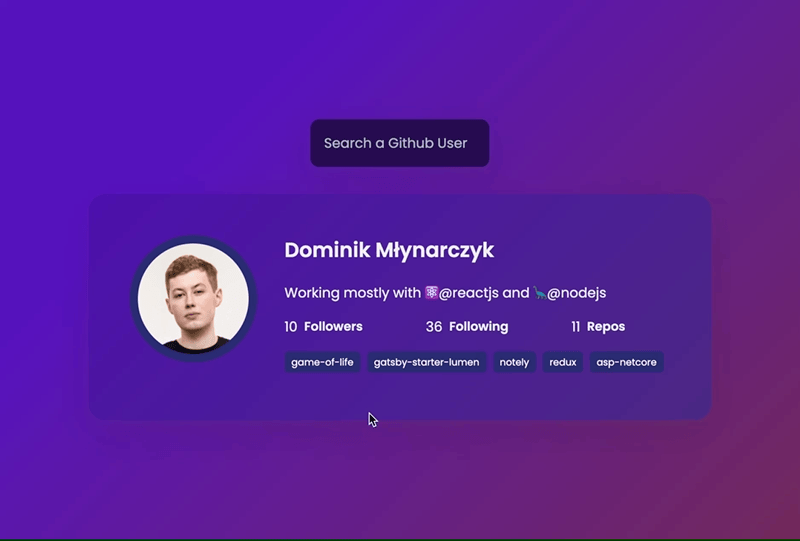

# 🎉 Projekty

**💡 UWAGA:** W katalogu z pracą domową utwórz katalog `04-project` w którym umieścisz rozwiązanie do wybranego przez siebie projektu. **Wybierz tylko jeden z poniższych dwóch projektów i wykonaj go zgodnie z założeniami.**

## 🎉 Challenge 1 - Github Profiles *(do zdobycia: 5 pkt.)*

Twoim zadaniem będzie pobranie danych z GitHuba. API Githuba dostępne jest pod następującym URI: https://api.github.com/users/

Aby pobrać dane konkretnego użytkownika ścieżka wygląda następująco: https://api.github.com/users/USER_NAME (w miejsce `USER_NAME` wstaw nazwę konta Github). Pobierz następujące dane z konta:

- Imię i nazwisko użytkownika
- Opis konta (jeśli go nie ma to wyświetl "Description not provided")
- Ilość obserwujących, obserwatorów oraz ilość publicznych repozytoriów
- Listę kilku publicznych repozytoriów z linkiem do niego

Dodatkowo aplikacja powinna oferować możliwość wyszukania konta Github dowolnej osoby i sprawdzenia informacji o danym koncie.

Przykład:

## 🎉 Challenge 2 - Notes app *(do zdobycia: 5 pkt.)*

Projekt zakłada przygotowanie prostej aplikacji do zarządzania notatkami. 

Aplikacja powinna udostępniać:

- możliwość dodania notatki
- każda notatka powinna mieć stan edycji i odczytu (domyślnie po utworzeniu notatki mamy włączony stan edycji)
- notatkę można usunąć

Wszystkie notatki powinny być zapisywane w *Local Storage*, co oznacza, że po odświeżeniu strony użytkownik nadal widzi swoje notatki.

Przykład:

